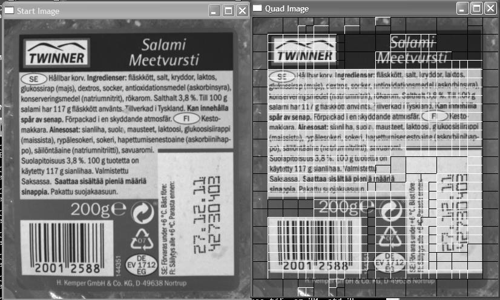

# Quadtree-image-decomposition
Fast quadtree image decomposition by recursive function

Test:
Python 2.7.8

Modules:
Numpy 1.8.2
Opencv 2.4.9

Usage:
$ python pyImgQuadTree.py -img test.tif -sz 20 -std 25.0

img = input image
sz  = min split size
std = image standard deviation to split

Image example:

